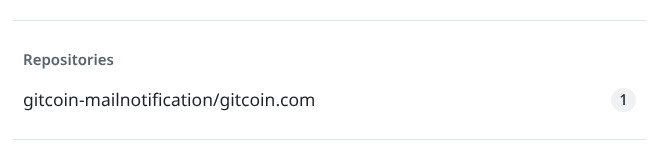

.. post:: 2025-10-19 08:00:00
    :tags: GitHub, GitHub Cli, notifications, abuse, snippets
    :category: Uncategorized

Deleting GitHub notifications
=============================

GitHub notifications are a great way to stay informed about activity on repositories you care about. However, sometimes there is also abuse or spam that clutters your notifications. Especially when another crypto project is involved and you get notified about every single issue or pull request they create. While the GitHub team takes measures to prevent abuse, it can still happen and affect your inbox as notification can get stuck in your list of unread notifications.

So also recently where a project started spamming issues across multiple repositories, leading to a flood of notifications for many users as shown below and the question arises how to deal with such unwanted notifications as you cannot simply mark them as read in bulk.

To resolve this situation, the notifications need to be deleted. Unfortunately, GitHub does not provide a built-in feature to bulk delete notifications through the web interface. However, you can use the GitHub API to delete notifications programmatically. With the command line tool `gh <//cli.github.com/>`_, you can easily interact with the GitHub API as shown below and get a list of your notifications first:

.. code-block:: shell
    :caption: Fetch GitHub notifications

    $ gh api notifications
    [
      {
        "id": "19089539954",
        "unread": true,
        "reason": "mention",
        "updated_at": "2025-09-22T01:11:02Z",
        "last_read_at": null,
        "subject": {
          "title": "Gitcoin Announcement | $15M Github & Gitcoin",
          "url": "https://api.github.com/repos/gitcoin-mailnotification/gitcoin.com/issues/401",
          "latest_comment_url": "https://api.github.com/repos/gitcoin-mailnotification/gitcoin.com/issues/401",
          "type": "Issue"
        },
        ...

.. warning::

    The actions below involve deleting notifications, which is irreversible. Ensure you understand the implications before proceeding.

It shows the notification ID `19089539954` which you can then use to delete the notification like this:

.. code-block:: shell
    :caption: Delete a GitHub notification

    $ gh api --method DELETE -H 'Accept: application/vnd.github+json' -H 'X-GitHub-Api-Version: 2022-11-28' notifications/threads/19089539954

Or in short and more modern form:

.. code-block:: shell
    :caption: Delete a GitHub notification

    $ gh api -X DELETE notifications/threads/19089539954

You can automate this process further by scripting the retrieval and deletion of notifications, allowing you to clean up your inbox efficiently. Always be cautious when deleting notifications to avoid losing important updates. Hopefully, GitHub will introduce better tools for managing notifications in the future to make this process easier for users.
